# Deep Bayesian Active Learning with Image Data

Reproduction and extension of [Deep Bayesian Active Learning with Image Data (Gal et al.) (2017)](https://arxiv.org/abs/1703.02910). It compares acquisition functions and Bayesian inference methods for pool-based active learning on image classification and regression tasks.

## Overview

Active learning reduces labelling cost by iteratively selecting the most informative points from an unlabeled pool. This project reproduces the original deep Bayesian active learning experiments with MC Dropout and extends them in several directions: switching from classification to last-layer Bayesian regression, implementing analytic and variational inference (including a Matrix-Normal posterior), and testing robustness under noisy labels, out-of-distribution pool contamination, and diversity-regularized batch selection.

All experiments use MNIST and Fashion-MNIST datasets.

## Key Contributions

Beyond reproducing the baseline from Gal et al. (2017), this project introduces four original extensions:

**Full feature covariance in Matrix-Normal VI.** The standard Matrix-Normal VI baseline uses a diagonal feature-space covariance. We allow the full covariance matrix U, capturing correlations between last-layer features in addition to output correlations.

**Robustness to noisy labels.** We introduce a noisy oracle that returns a uniformly random wrong class with probability η, simulating imperfect annotation. We compare uncertainty-based acquisition against random sampling across noise levels η ∈ {0, 0.15}.

**OOD pool contamination.** We mix out-of-distribution samples (Fashion-MNIST) into the MNIST unlabeled pool at varying ratios p ∈ {0, 0.1, 0.3, 0.5} and track whether uncertainty-based acquisition over-selects OOD points.

**Diversity-regularized batch acquisition.** We add a similarity-based penalty to the acquisition score, greedily building batches that are both uncertain and diverse in feature space.

## Methods

### Inference

| Method | Description |
|--------|-------------|
| MC Dropout | Stochastic forward passes at test time (classification) |
| Analytic | Closed-form Bayesian linear regression on last-layer features |
| MFVI | Mean-field variational inference (diagonal, fully factorized) |
| MN-VI (diag U, full V) | Matrix-Normal VI with diagonal feature covariance |
| MN-VI (full U, full V) | Matrix-Normal VI with full feature covariance *(novel)* |

### Acquisition Functions

| Function | Task | Formula |
|----------|------|---------|
| BALD | Classification | Mutual information between predictions and weights |
| Max Entropy | Classification | Predictive entropy H[y \| x, D] |
| Variation Ratios | Classification | 1 − max_y p(y \| x, D) |
| Mean STD | Classification | Mean standard deviation across classes |
| Trace | Regression | tr(Σ(x)) — trace of predictive covariance |
| Random | Both | Uniform random selection (baseline) |

## Project Structure

```
├── models.py                    # Bayesian CNN (Conv-Dropout-Dense-Softmax)
├── acquisition.py               # Acquisition functions + diversity-aware selection
├── active_process.py            # Active learning loop (classification)
├── model_utils.py               # Training, MC forward, evaluation utilities
├── process_data.py              # Data loading, splits, noisy labels (classification)
├── process_data_regression.py   # Data loading with OOD pool support (regression)
├── regression_active_process.py # Active learning loop + Bayesian inference (regression)
├── regression_utils.py          # Analytic / MFVI / VI / VI-full inference implementations
│
├── experiments/
│   ├── run_cnns.py              # Entry point: classification experiments
│   ├── regression.py            # Entry point: regression experiments
│   ├── noisy_oracle.py          # Entry point: noisy label experiments
│   ├── run_ood_experiments.sh   # Script: OOD pool experiments
│   ├── plot_exp1.py             # Plot: acquisition function comparison
│   ├── plot_exp2.py             # Plot: Bayesian vs deterministic
│   ├── plot_regression.py       # Plot: regression results
│   ├── plot_noisy_oracle.py     # Plot: noisy oracle results
│   └── plot_ood_experiments.sh  # Script: OOD plots
│
├── configs/                     # YAML experiment configurations
├── results/                     # Saved CSV results (per experiment)
└── plots/                       # Generated figures (PNG + PDF)
```

## Quick Start

### Installation

```bash
pip install -r requirements.txt
```

### Run Experiments

**Classification** — compare acquisition functions on MNIST:
```bash
python3 -m experiments.run_cnns --config configs/base.yaml \
    --results-directory results/classification_base
```

**Regression** — compare inference methods on MNIST:
```bash
python3 -m experiments.regression --config configs/base_regression.yaml \
    --results-directory results/regression
```

**Noisy oracle** — test robustness to label noise:
```bash
python3 -m experiments.noisy_oracle --config configs/noisy_oracle.yaml \
    --results-directory results/classification_noisy_oracle
```

**OOD pool** — test with out-of-distribution contamination:
```bash
./experiments/run_ood_experiments.sh
```

### Generate Plots

```bash
python3 -m experiments.plot_exp1 --results-directory results/classification_base
python3 -m experiments.plot_regression --results-directory results/regression
```

---

## Results

### 1. Classification: Acquisition Function Comparison

**Baseline reproduction** — BALD, Variation Ratios, Max Entropy, Mean STD vs Random on MNIST and Fashion-MNIST using a Bayesian CNN with MC Dropout.

<details>
<summary>Run & plot commands</summary>

```bash
# MNIST
python3 -m experiments.run_cnns --config configs/base.yaml --results-directory results/classification_base
python3 -m experiments.plot_exp1 --results-directory results/classification_base

# Fashion-MNIST
python3 -m experiments.run_cnns --config configs/fashion.yaml --results-directory results/classification_fashion
python3 -m experiments.plot_exp1 --results-directory results/classification_fashion
```
</details>

**MNIST:**

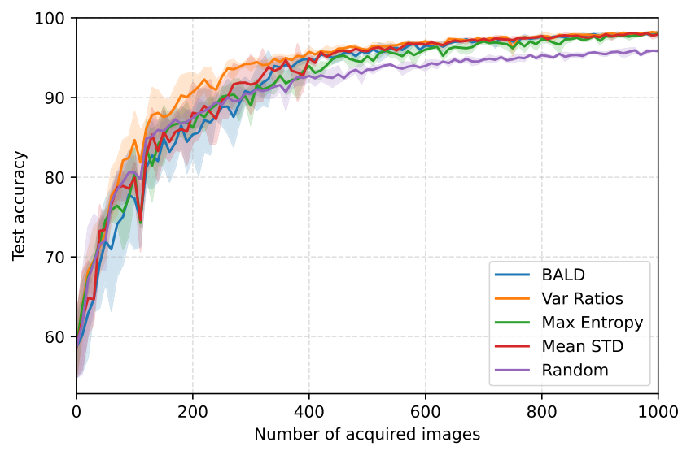

On MNIST, uncertainty-based acquisition works better than Random in the early steps, and the curves converge as more labels are acquired.

| Acquisition Function | Threshold | Acquired (mean ± std) | Step (mean ± std) |
|---------------------|-----------|----------------------|-------------------|
| BALD | 0.05 | 400.0 ± 10.0 | 40.0 ± 1.0 |
| BALD | 0.1 | 266.7 ± 49.3 | 26.7 ± 4.9 |
| Var Ratios | 0.05 | 350.0 ± 10.0 | 35.0 ± 1.0 |
| Var Ratios | 0.1 | 176.7 ± 45.1 | 17.7 ± 4.5 |
| Max Entropy | 0.05 | 473.3 ± 49.3 | 47.3 ± 4.9 |
| Max Entropy | 0.1 | 253.3 ± 15.3 | 25.3 ± 1.5 |
| Mean STD | 0.05 | 366.7 ± 50.3 | 36.7 ± 5.0 |
| Mean STD | 0.1 | 260.0 ± 70.0 | 26.0 ± 7.0 |
| Random | 0.05 | 720.0 ± 55.7 | 72.0 ± 5.6 |
| Random | 0.1 | 253.3 ± 11.5 | 25.3 ± 1.2 |

**Fashion-MNIST:**

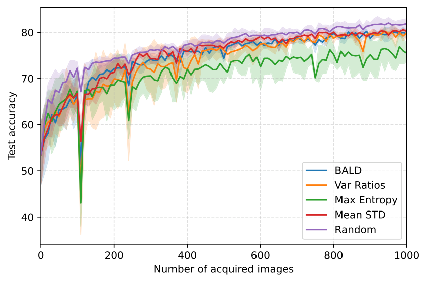

On Fashion-MNIST, Random sampling is often competitive and max entropy acquisition can look unstable. Fashion-MNIST contains many genuinely hard and visually similar classes (e.g., shirt/top/pullover), so high predictive entropy does not always mean "useful for improving the classifier". As a result, selecting the top-entropy points may produce a batch that is dominated by ambiguous near-boundary examples or class-imbalanced. Since we retrain the model from scratch each round (with the same initialization), the newly acquired batch can noticeably reshape the decision boundary. If that batch is not representative, test accuracy can temporarily drop after retraining, and then recover in later rounds as the labeled set grows and becomes more balanced and informative overall.

---

### 2. Classification: Importance of Model Uncertainty

Comparing Bayesian (MC Dropout, T > 1) vs Deterministic (no dropout, T = 1) inference for BALD, Variation Ratios, and Max Entropy.

<details>
<summary>Run & plot commands</summary>

```bash
python3 -m experiments.run_cnns --config configs/base.yaml --results-directory results/classification_base
python3 -m experiments.plot_exp2 --results-directory results/classification_base
```
</details>

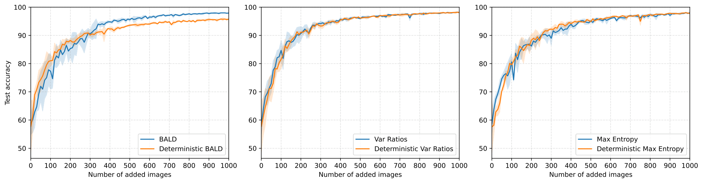

With dropout disabled and T=1, BALD scores are zero for all samples; in our implementation we do random selection in this case. BALD benefits the most from Bayesian inference because it targets epistemic uncertainty.

---

### 3. Regression: Inference Methods Comparison

Comparing analytic inference, MFVI, Matrix-Normal VI (diag U), and Matrix-Normal VI (full U) on last-layer Bayesian regression. The acquisition function is trace of the predictive covariance.

<details>
<summary>Run & plot commands</summary>

```bash
# MNIST
python3 -m experiments.regression --config configs/base_regression.yaml --results-directory results/regression
python3 -m experiments.plot_regression --results-directory results/regression

# Fashion-MNIST
python3 -m experiments.regression --config configs/fashion_regression.yaml --results-directory results/regression_fashion
python3 -m experiments.plot_regression --results-directory results/regression_fashion
```
</details>

**MNIST:**

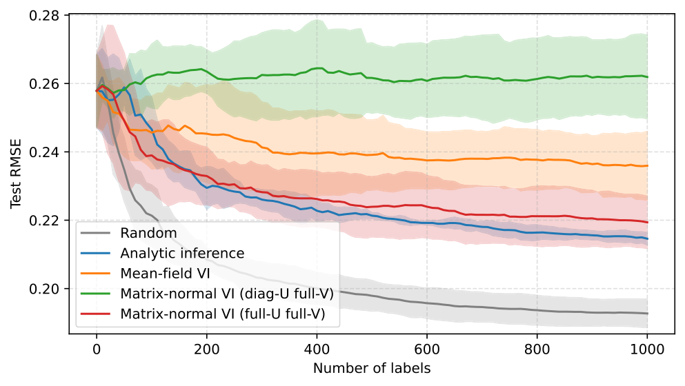

**Fashion-MNIST:**

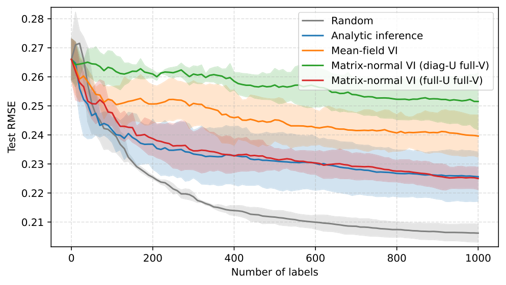

In these runs, Random gives the lowest RMSE (better coverage), while analytic and full-covariance VI perform similarly. Mean-field VI is the least effective due to its independence assumptions. Variance-based acquisition underperforms Random on RMSE because reducing uncertainty does not always improve generalization — especially with frozen features and Gaussian regression on discrete one-hot labels.

---

### 4. Extension: OOD Pool Contamination

Mixing Fashion-MNIST (OOD) into the MNIST unlabeled pool at ratios p ∈ {0, 0.1, 0.3, 0.5}. Each plot shows ID test RMSE (top) and cumulative OOD selection rate (bottom).

<details>
<summary>Run & plot commands</summary>

```bash
./experiments/run_ood_experiments.sh
./experiments/plot_ood_experiments.sh
```
</details>

| OOD ratio | Results |
|-----------|---------|
| p = 0.0 | 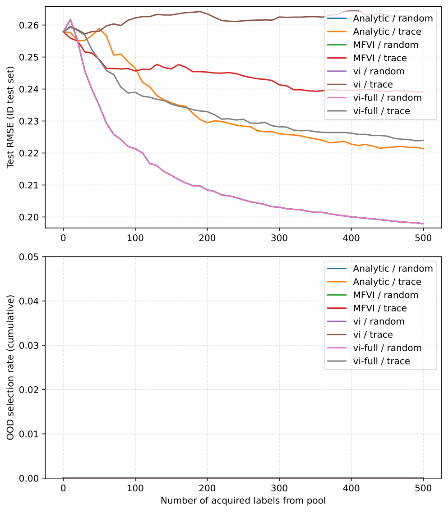 |
| p = 0.1 | 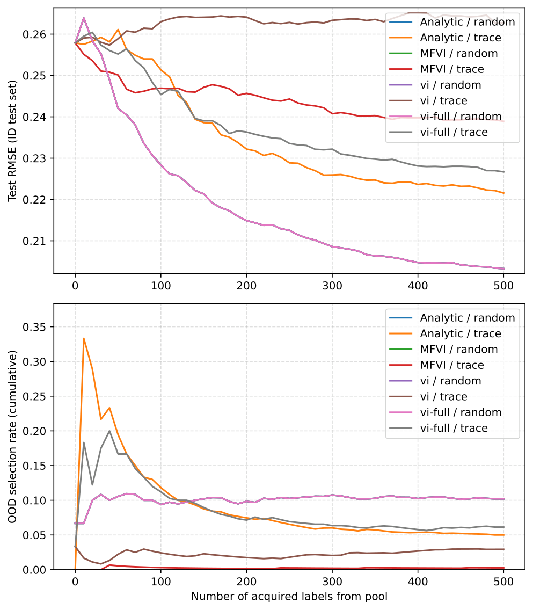 |
| p = 0.3 | 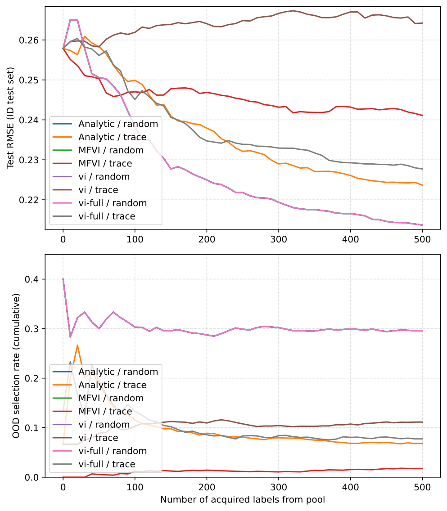 |
| p = 0.5 | 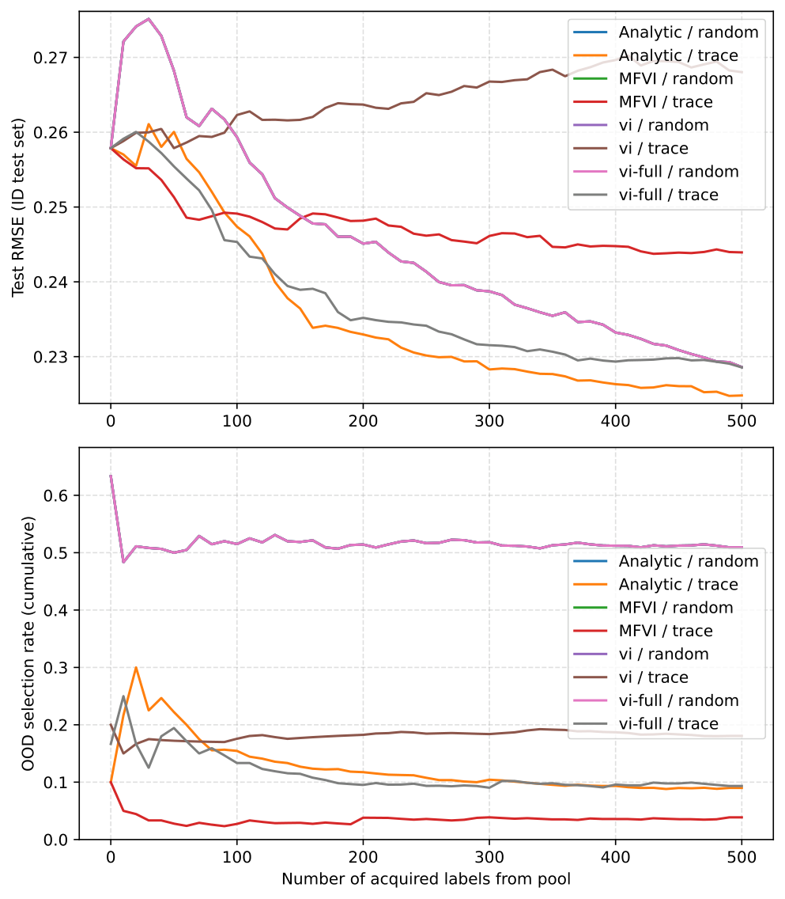 |

With OOD in the pool, uncertainty-based strategies can over-select OOD early (OOD often has higher epistemic uncertainty). Strategies that keep the OOD selection rate closer to the pool ratio tend to be more stable on the ID test RMSE.

---

### 5. Extension: Noisy Oracle

Testing robustness to annotation noise: the oracle returns a uniformly random wrong class with probability η.

<details>
<summary>Run & plot commands</summary>

```bash
# Classification
python3 -m experiments.noisy_oracle --config configs/noisy_oracle.yaml --results-directory results/classification_noisy_oracle
python3 -m experiments.plot_noisy_oracle --config configs/noisy_oracle.yaml --results-directory results/classification_noisy_oracle

# Regression
python3 -m experiments.noisy_oracle --config configs/noisy_oracle.yaml --results-directory results/regression_noisy_oracle
python3 -m experiments.plot_noisy_oracle --config configs/noisy_oracle.yaml --results-directory results/regression_noisy_oracle
```
</details>

**Classification (η = 0.0 and η = 0.15):**

| | |
|---|---|
| 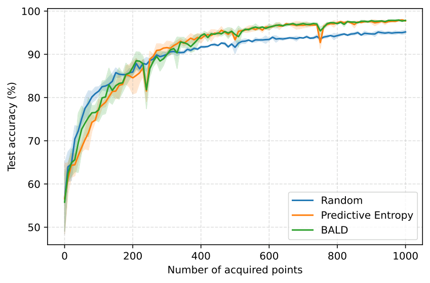 | 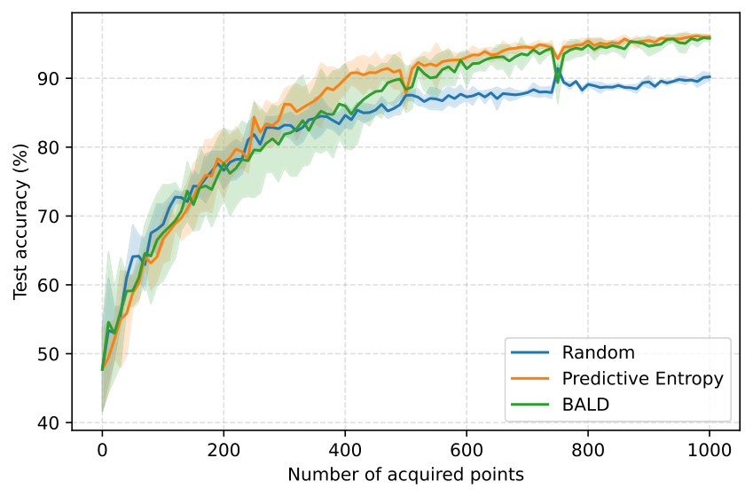 |

With label noise (η = 0.15), all methods become less stable and the final accuracy is lower. Even with noise, BALD and Entropy are usually better than Random, especially after the first 100–300 acquired points.

**Regression (η = 0.0 and η = 0.15):**

| | |
|---|---|
| 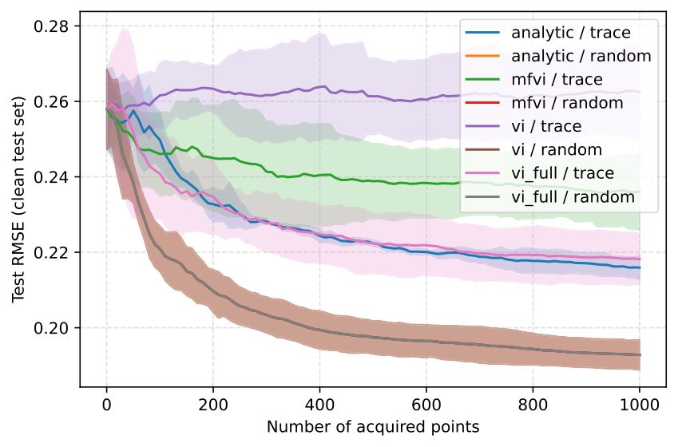 | 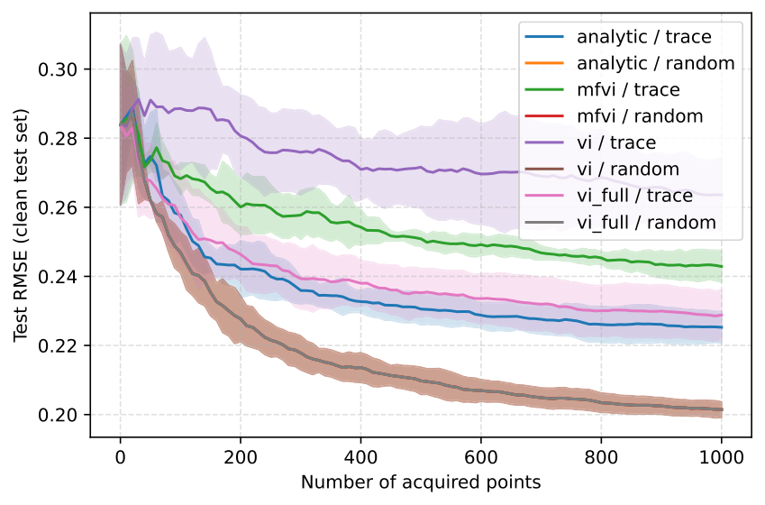 |

In both settings, Random acquisition consistently gives lower RMSE than trace for all inference methods. With noisy labels, this difference becomes even clearer: the trace rule focuses on the most uncertain points, and if some of those labels are wrong, training can be harmed more.

---

### 6. Extension: Diversity-Regularized Batch Acquisition

Adding a feature-space similarity penalty to the acquisition score, building batches that are both uncertain and diverse.

<details>
<summary>Run & plot commands</summary>

```bash
# Classification (Fashion-MNIST)
python3 -m experiments.run_cnns --config configs/fashion_div.yaml --results-directory results/classification_fashion_div
python3 -m experiments.plot_exp1 --results-directory results/classification_fashion_div

# Regression (Fashion-MNIST)
python3 -m experiments.regression --config configs/fashion_regression_div.yaml --results-directory results/regression_fashion_div
python3 -m experiments.plot_regression --config configs/fashion_regression_div.yaml --results-directory results/regression_fashion_div
```
</details>

**Classification (Fashion-MNIST with diversity):**

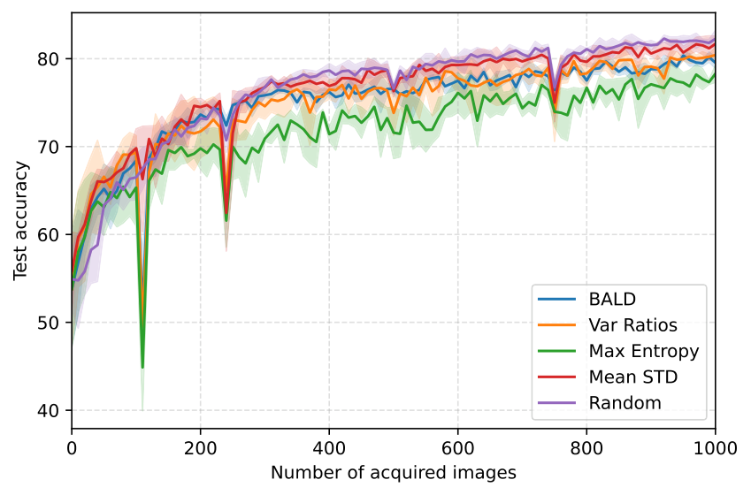

**Regression (Fashion-MNIST with diversity):**

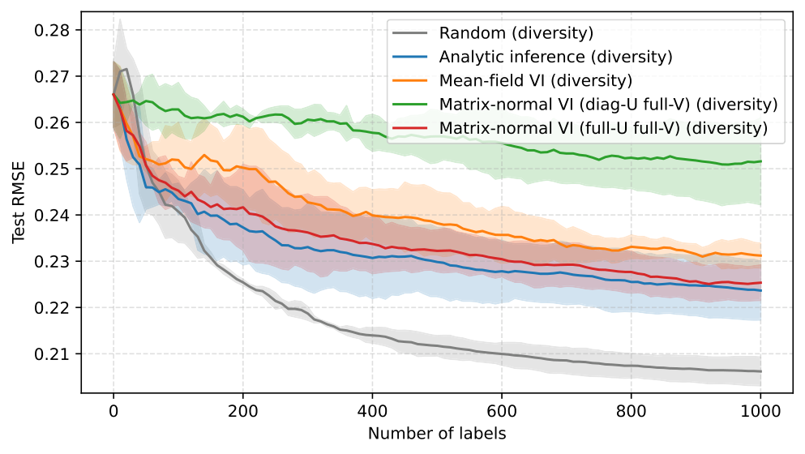

Diversity reduces redundancy (near-duplicate points in a batch) and mainly stabilizes selection, but it does not guarantee an improvement over Random on Fashion-MNIST, suggesting the gap is driven more by the acquisition signal than by batch redundancy.

---

## References

- Gal, Y., Islam, R. & Ghahramani, Z. (2017). *Deep Bayesian Active Learning with Image Data.* ICML 2017.